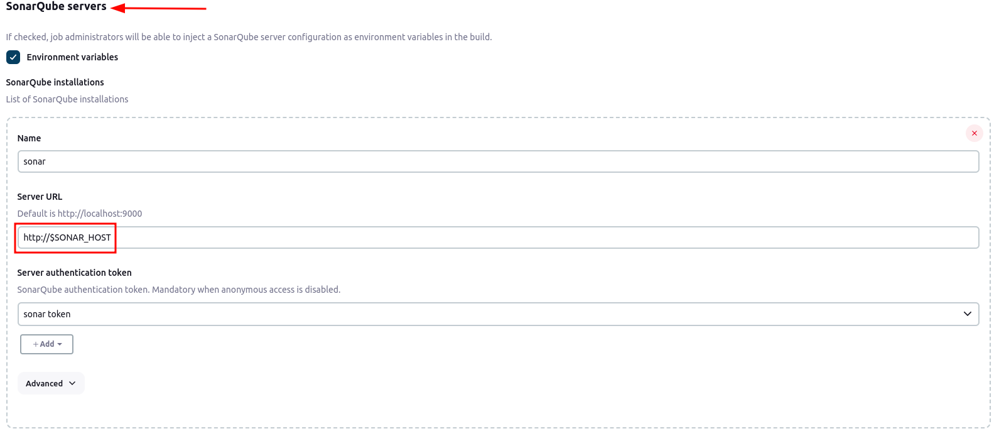

# Simulando um ambiente de entrega contínua
Um ambiente completo de CI/CD rodando em um cluster k8s, utilizando a estratégia de pull com ArgoCD e Jenkins.

## Configuração webhook gitea
Adicionar configuração no gitea para adicionar o host do jenkins na lista de hosts confiáveis para webhook.
```yaml
additionalConfigFromEnvs:
  - name: GITEA__webhook__ALLOWED_HOST_LIST
    value: jenkins.jenkins.svc.cluster.local
```    

## Configuração hosts Jenkins
Adicionar o ip do ingress controller no node do jenkins para que seja possível alcançar os serviços
```yaml
hostAliases:   
  - ip: 172.18.0.50
    hostnames:
      - gitea.localhost.com
```
Alterar configuração em Manage Jenkins/Security/Git Host Key Verification Configuration para "Accept first connection" para que não dê erro de known-hosts na primeira tentativa de conexão ssh. Nas próximas conexões fará a verificação.

## Configuração nginx ingress controle - expondo a porta 22
Adicionar configuração nos values do nginx ingress controller para que seja possível fazer git clone via ssh de dentro do Jenkins com contas de serviço
```yaml
tcp:
  22: "gitea/gitea-ssh:22"
```

## Instalando helm-chart da aplicação de exemplo "java-microservice"
Esta é uma aplicação Java que se conecta em um banco relacional PostgreSQL. O chart da aplicação declara uma dependência para o chart do postgresql.
Ao instalar o chart da aplicação automaticamente o postgresql será instanciado.

*Importante:* ao desinstalar o chart precisa remover manualmente o PVC criado pelo postgresql, por algum motivo esses recursos não são limpos. É necessário fazer isso pois na próxima instalação começa a dar erro de autenticação pelo fato de existir um PVC criado anteriormente. [Este é um bug conhecido](https://github.com/helm/helm/issues/5156). 

Ver mais em: https://docs.bitnami.com/kubernetes/faq/troubleshooting/troubleshooting-helm-chart-issues/


Exemplo de instalação do chart:
```bash
helm upgrade --install teste-microservice java-microservice/ \
--set app.dbUser=teste \
--set app.dbPass=teste \
--set app.dbName=teste \
--set postgresql.auth.database=teste \
--set postgresql.auth.username=teste \
--set postgresql.auth.password=teste
```

## Criando um PersistentVolume para utilizar cache do maven repository
Para otimização do tempo da pipeline é importante termos uma maneira de cachear bibliotecas previamente baixadas.
Para este projeto foi criado um `PersistentVolume` com tipo `local` e um `PersistentVolumeClaim`.
O arquivo `./manifests/maven-pv.yaml` cria esses manifestos. Para utilização na pipeline, podemos declarar no template
do pod (ver `Jenkinsfile` em `./java-microservice/Jenkinsfile`).
O volume está com NodeAffinity em um dos workers, isso é obrigatório em tipos
de volume `local`. É necessário que o diretório do volume exista previamente. Neste projeto foi decidido conectar-se ao container do node e criar o diretório manualmente.

## Configurações do Sonar
Para evitar do Jenkins bater no ingress controller com o host externo do Sonar, decidi evitar esse tráfego desnecessário e configurei o host do serviço do Sonar como variável de ambiente no container, desta forma a comunicação fica direto no cluster sem passar por nenhum filtro de host. Trecho de configuração do Jenkinsfile do serviço `java-microservice`:
```bash
envVars: [
    envVar(key: 'SONAR_HOST', value: 'sonarqube-sonarqube.sonar.svc.cluster.local:9000')
]
```

Na configuração do Sonar dentro do Jenkins (Dashboard/Manage Jenkins/System), ao invés de colocar o host http://sonarqube.localhost.com substituí pela variável de ambiente criada previamente `SONAR_HOST`:



### Configuração do webhook no Sonar
Para o Sonar notificar o Jenkins de que o Quality Gate falhou ou passou, configurar a URL do webhook: `url-do-jenkins/sonarqube-webhook/`. [OBS: a barra no final da URL é mandatória](https://docs.sonarsource.com/sonarqube/latest/analyzing-source-code/ci-integration/jenkins-integration/pipeline-pause/).


Configurar stage na pipeline:
```yaml
stage("Quality Gate") {
  steps {
    timeout(time: 1, unit: 'MINUTES') {
      waitForQualityGate abortPipeline: true
    }
  }
}
```

## Configuração alternativa para a pipeline do Jenkins
O arquivo abaixo é uma forma declarativa de configurar uma pipeline do Jenkins:

```yaml
# Jenkinsfile-teste

pipeline {
    options {
      disableConcurrentBuilds()
    }
    agent any
    stages {
        stage('unit test') {
          steps {
            container('maven') {
              script {
                  sh 'mvn clean'
                  sh 'mvn install'
              }
            }
          }
        }
        stage('sonar') {
          steps {
            container('maven') {
              withSonarQubeEnv('sonar') {
                sh '''
                mvn org.sonarsource.scanner.maven:sonar-maven-plugin:3.11.0.3922:sonar \
                -Dsonar.token=${SONAR_AUTH_TOKEN} \
                -Dsonar.projectName=${JOB_NAME%/*}-${BRANCH_NAME}
                '''
              } 
            }
          }
        }
    }
}
```

Com o Jenkinsfile acima, é necessário configurar um container do maven no podTemplate padrão:


A parte do cache do maven também pode ser configurada direto no Jenkins:


A diferença é que esse volume é montado para todos os containers, e na abordagem anterior (ver arquivos Jenkinsfile e podTemplate.yaml) era só aplicado no container do maven.

Configurar a variável `SONAR_HOST` conforme abaixo:


